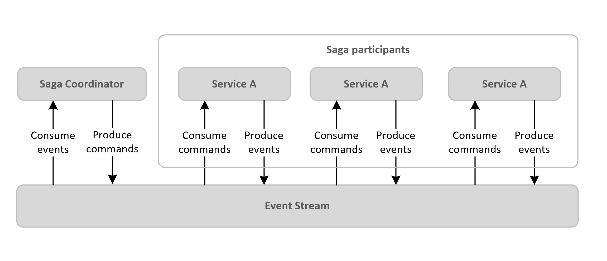

# Saga Coordinator as a Finite State Machine (FSM) in Java

## Background

Coordination is a Saga's approach where the coordination logic is centralized in a *Saga Coordinator*, also known as *Reactive Orchestrator*. It uses the concept of **commands** and **events**, where commands are tasks that need to be done and events are tasks that have been done. 

The Saga Coordinator produces commands to an event stream and the respective saga participants consume these commands. These participants produce their events after performing their operations and the coordinator consume these Event.

The Saga Coordinator can be implemented as a Finite State Machine (FSM), where it produces commands and waits for events produced by the participants to drive the flow. Events are represented as nodes, while commands are represented as transitions between nodes.

## About the sample

The sample contains an FSM Saga Coordinator using [Spring Statemachine](https://projects.spring.io/spring-statemachine/) as the foundation and [Apache Kafka](https://kafka.apache.org/intro.html) as the distributed streaming platform. The state machine has the following components and features:

- [Spring Cloud Stream](https://cloud.spring.io/spring-cloud-stream-binder-kafka/) with Kafka binder to allow transparent connectivity with Kafka topics
- [Apache Avro](https://avro.apache.org/) for data serialization
- [Redis](https://redis.io/) to persist the state machine context
- [MongoDb](https://www.mongodb.com/) to persist all payloads used in transitions between nodes
